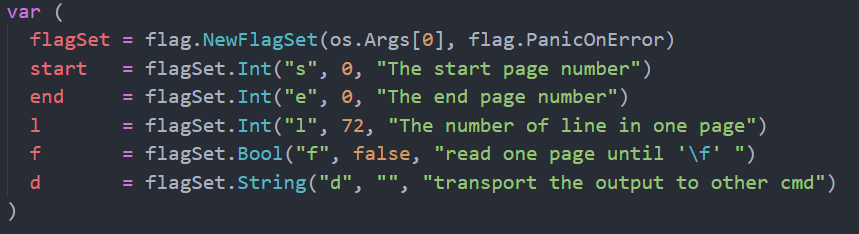

# Goselpg
Use Golang to implement a command line Interface called selpg

#### Usage

1. Download or clone the project to you PC
2. Then put the selpg folder into your src folder of your Go Project (Go Project has three children folder: bin, pkg, src)
3. And then go into Goproject/src path, call CLI and input "go install selpg". You will see a selpg in GoProject/bin
4. Finally,  go into Goproject/bin, call system CLI and input like "selpg -s=1 -e=2 -l=1 -f input.txt output.txt error.txt"

#### Design about selpg

* The Design of the flagSet can be see as follows:

* Design a function called checkForSE to check the validity of the options. The return of the function checkForSE is a bool variable

  

* Design a function called fileIO(Ibuf *bufio.Reader, Obuf *os.File)  in order to transfer the message from the given input(Ibuf *bufio.Reader) to the given output(Obuf *os.File).  **(See source code for details)**

  If the Obuf is nil, the message will be transfered to the standard output, otherwise it will be tranfer to the given file

* Design a function called tranData(inputFilePath string, outputFilePath string)  to generate Ibuf *bufio.Reader and Obuf *os.File and pass them to the function fileIO(Ibuf *bufio.Reader, Obuf *os.File **(See source code for details)**

* Then in the main function, It can be see as follows：

#### Test about selpg

input.txt is initialized like:

It was write by:

1. selpg -s=1 -e=1 -l=2 input.txt 
2. selpg -s=1 -e=1 -l=2 < input.txt 
3. cat selpg.go | selpg -s=1 -e=1 -l=2 
4. selpg -s=1 -e=1 -l=2 input.txt > output.txt  
5. selpg -s=1 -e=-1 input.txt 2> error.txt 
6. selpg -s=1 -e=2 -l=200 input.txt > output.txt 2> error.txt  
7. selpg -s=1 -e=2 -l=200 input.txt > output.txt 2>/dev/null 
8. selpg -s=1 -e=2 -l=200 input.txt > /dev/null 
9. selpg -s=1 -e=2 -l=200 input.txt | cat 
10. selpg -s=1 -e=2 -l=200 input.txt 2> error.txt | cat 
11. selpg -s=1 -e=2 -f input.txt 
12. selpg -s1=1 -e=2 -l=1 -d=cat input.txt 

**PS:The detail about selpg -s1=1 -e=2 -l=1 -d=cat input.txt**

​	I construct a pipe to the system cmd "cat" input, and write the output of the selpg to the pipe. This is   like transfer the output of the selpg to the printer through pipe. In other words, this function is like the lp. 

##Thanks!

